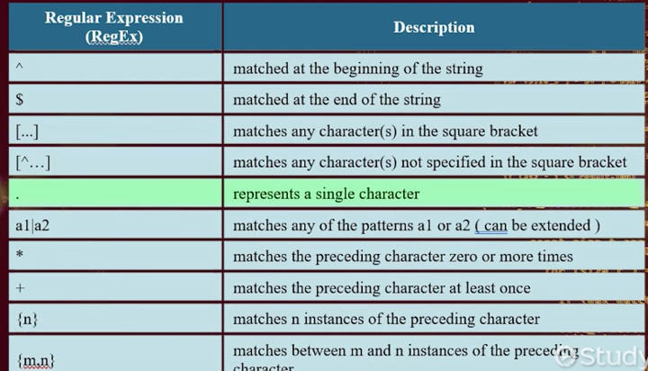
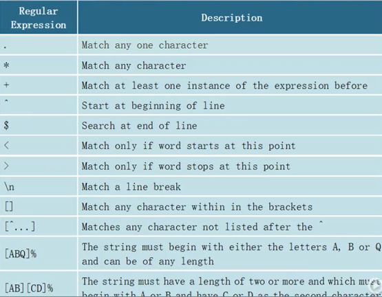

### Section 1: Regular Expressions

#### What Is a Regular Expression?

* A **regular expression (regex)** is a string that defines a **search pattern**.
* Used to **match**, **search**, and **manipulate** strings.
* Supported across most programming languages and databases.

---

#### Common Regex Elements

| Symbol  | Function                                                  |
| ------- | --------------------------------------------------------- |
| `.`     | Matches any single character                              |
| `[]`    | Character set (e.g., `[aeiou]`)                           |
| `\`     | Escapes a special character (e.g., `\.` matches a period) |
| `{n}`   | Exact number of repetitions                               |
| `{n,}`  | At least n repetitions                                    |
| `{n,m}` | Between n and m repetitions                               |

---

#### Basic Examples

**Text:** `"Go over to the oven for a pair of gloves."`

* Regex: `ove.` → Matches **`over`**, **`oven`**, **`glove`**
* Regex: `es\.` → Matches `es.` (e.g., `expressions.`)

**Text:** `"Let's test 5 regular expressions with some examples."`

* Regex: `ex[aeiou]` → Matches `exa`, `exe`, `exi`, etc.
* Regex: `e.{2}` → Matches `e` followed by **any 2 characters**

---

#### Complex Examples

**1. First and Last Name Validator**

```regex
[a-zA-Z]{1,} [a-zA-Z]{1,}
```

* Matches: a first and last name (no middle name), e.g., `John Smith`.

**2. Basic Email Validator**

```regex
[a-zA-Z0-9_.+-]{1,}@[a-zA-Z0-9-]{1,}\.[a-zA-Z0-9-.]{2,}
```

* Matches: `john.doe@example.com`, `user+mail@sub-domain.co.uk`

---

#### Real-World Code Examples

**JavaScript - Validate Currency**

```javascript
var oMoneyRegExp = /^\$[0-9]{1,}.?[0-9]{0,2}$/;
oMoneyRegExp.test('$20.99'); // true
oMoneyRegExp.test('2099$');  // false
```

* `^` - Start of string
* `\$` - Literal dollar sign
* `[0-9]{1,}` - One or more digits
* `.?[0-9]{0,2}` - Optional decimal + up to two digits
* `$` - End of string

**Python - Replace Vowels**

```python
import re
s = 'ABCDEFGHIJKLMNOPQRSTUVWXYZ'
print(re.sub(r'[AEIOU]', '?', s))
# Output: ?BCD?FGH?JKLMN?PQRST?VWXYZ
```

---

#### Summary

* **Regular expressions** define **string search patterns**.
* Use special characters like `.` `[]` `\` `{}` for advanced matching.
* Key applications: **validation**, **search**, **replace** operations.
* Supported widely across **SQL**, **JavaScript**, **Python**, etc.

### Section 2: Regular Expressions in MySQL

#### What Are Regular Expressions (Regex) in MySQL?

* **Regex** allows **pattern-based filtering** in SQL queries.
* Used primarily with the `REGEXP` (MySQL 5.7) or `REGEXP_LIKE()` (MySQL 8.0+) clause.
* Ideal for **complex string matching**, such as validating formats or partial matches.

---

#### Basic Syntax

```sql
SELECT * FROM table WHERE column REGEXP 'pattern';
```

* `REGEXP` is case-insensitive by default.
* MySQL 8.0+ supports `REGEXP_LIKE(column, pattern)` for compatibility with Oracle-style syntax.

---

#### Regex Symbol Reference

| Symbol   | Description                    |                |
| -------- | ------------------------------ | -------------- |
| `^`      | Match beginning of string      |                |
| `$`      | Match end of string            |                |
| `[...]`  | Match any character in set     |                |
| `[^...]` | Match any character NOT in set |                |
| `.`      | Match any single character     |                |
| \`a1     | a2\`                           | Match a1 or a2 |
| `*`      | Zero or more repetitions       |                |
| `+`      | One or more repetitions        |                |
| `{n}`    | Exactly n repetitions          |                |
| `{m,n}`  | Between m and n repetitions    |                |

---

#### Regex Examples in MySQL

**1. Match words starting with A, B, or C**

```sql
SELECT * FROM Dictionary WHERE UPPER(Word) REGEXP '^(A|B|C)';
```

**2. Match words ending in 'sh'**

```sql
SELECT * FROM Dictionary WHERE Word REGEXP '[s][h]$';
```

**3. Match words ending in 's' or 'h'**

```sql
SELECT * FROM Dictionary WHERE Word REGEXP '[sh]$';
```

**4. Match words NOT starting with 'b'**

```sql
SELECT * FROM Dictionary WHERE Word REGEXP '^[^b]';
```

**5. Match 'b' followed by any char, then 's'**

```sql
SELECT * FROM Dictionary WHERE Word REGEXP '[b].[s]';
```

**6. Match words with 'ba' or 'bu'**

```sql
SELECT * FROM Dictionary WHERE Word REGEXP '[b][a]|[b][u]';
```

**7. Match words with exactly two 'r' characters in a row**

```sql
SELECT * FROM Dictionary WHERE Word REGEXP '[r]{2}';
```

**8. Match any word (zero or more 'r's)**

```sql
SELECT * FROM Dictionary WHERE Word REGEXP '[r]*';
```

**9. Match words with at least one 'r'**

```sql
SELECT * FROM Dictionary WHERE Word REGEXP '[r]+';
```

**10. Match words with only vowels**

```sql
SELECT * FROM Dictionary WHERE NOT Word REGEXP '[^aeiou]';
```

**11. Match words starting with 'b', ending in 'l', with at least one character between**

```sql
SELECT * FROM Dictionary WHERE Word REGEXP '^[b][a-z]+[l]$';
```

**12. Match words starting with 'b' and ending in 'l' or 'h'**

```sql
SELECT * FROM Dictionary WHERE Word REGEXP '^[b][a-z]+[l|h]$';
```

**13. Validate exact 7-digit numbers**

```sql
SELECT * FROM TestNumber WHERE Number REGEXP '^[0-9]{7}$';
```

---

#### Summary

* **Regex in MySQL** provides compact, powerful ways to match and filter data.
* Useful for **string patterns**, **validation**, and **cleaner queries**.
* MySQL 8.0’s `REGEXP_LIKE()` enhances support and aligns with Oracle syntax.
* Regex improves both **query readability** and **performance** in complex text matching.



Here is the corrected version with only one `###` level heading for the title:

### Section 3: Regular Expressions in SQL Server

---

#### 🔍 **Definition of Regular Expressions (Regex)**

* A **regular expression** defines a character pattern used for searching and filtering.
* In **SQL Server**, regex functionality is limited to pattern matching using the `LIKE` operator and square bracket syntax. Full regex requires external tools or CLR integration.

---

#### ✅ **Basic Pattern Matching with LIKE and Wildcards**

| SQL Expression | Meaning                   |
| -------------- | ------------------------- |
| `'P%'`         | Begins with P             |
| `'%P%'`        | Contains P anywhere       |
| `'[P]%'`       | Begins with exactly one P |
| `'%[P]%'`      | Contains at least one P   |

---

#### 🧠 **Regex-like Syntax Used with LIKE**

| Symbol | Meaning                      |
| ------ | ---------------------------- |
| `.`    | Any single character         |
| `*`    | Any number of characters     |
| `+`    | One or more instances        |
| `^`    | Start of string              |
| `$`    | End of string                |
| `[]`   | Character class              |
| `[^]`  | NOT the listed characters    |
| `< >`  | Word boundaries (start/stop) |

---

#### 🧪 **Example Queries**

**1. Name Starts with P**

```sql
SELECT * FROM Survey WHERE RespondentFullName LIKE '[P]%';
```

**2. Name Contains P**

```sql
SELECT * FROM Survey WHERE RespondentFullName LIKE '%[P]%';
```

**3. Name Contains A (Case-insensitive)**

```sql
SELECT RespondentFullName, ContactNo FROM Survey WHERE RespondentFullName LIKE '%[A]%';
```

**4. Name Contains Any Char Except P**

```sql
SELECT RespondentFullName, ContactNo FROM Survey WHERE RespondentFullName LIKE '%[^P]%';
```

⚠️ This returns names that contain at least one character not equal to P (still includes names with P).

---

#### 🔡 **Case Sensitivity in SQL Server**

* SQL Server collation is **not case-sensitive** by default.
* Use **collation settings** to enforce case sensitivity.

```sql
SELECT RespondentFullName, ContactNumber 
FROM Survey 
WHERE RespondentFullName COLLATE Latin1_General_BIN LIKE '%[E]%';
```

---

#### 🔢 **Matching Numbers with Regex-Like Expressions**

**1. Match LuckyDrawNumber with 789 or 5467**

```sql
SELECT RespondentFullName, LuckyDrawNumber 
FROM Survey 
WHERE LuckyDrawNumber LIKE '%[7][8][9]%' 
   OR LuckyDrawNumber LIKE '%[5][4][6][7]%';
```

**2. Match 8xx6 Pattern**

```sql
SELECT RespondentFullName, LuckyDrawNumber 
FROM Survey 
WHERE LuckyDrawNumber LIKE '%[8][0-9][0-9][6]%';
```

---

#### 📧 **Regex-like Matching for Email Patterns**

* Pattern: any letters + @ + domain + `.com` or `.edu`

```sql
SELECT RespondentFullName, Answer 
FROM Survey 
WHERE Answer LIKE '%[A-Z]%[@][A-Z]%[.][c][o][m]%' 
   OR Answer LIKE '%[A-Z]%[@][A-Z]%[.][e][d][u]%';
```

---

#### 📝 **Lesson Summary**

* SQL Server supports basic **regex-like** operations using the `LIKE` operator with character classes (`[ ]`).
* Full regex is not natively supported in T-SQL—true regex requires plug-ins or CLR integration.
* Regex-like syntax enables **filtering names, numbers, and validating formats** like emails.
* **Case sensitivity** must be explicitly enforced with `COLLATE` settings.
* Regex enhances **data validation, extraction, and quality control** in structured queries.


